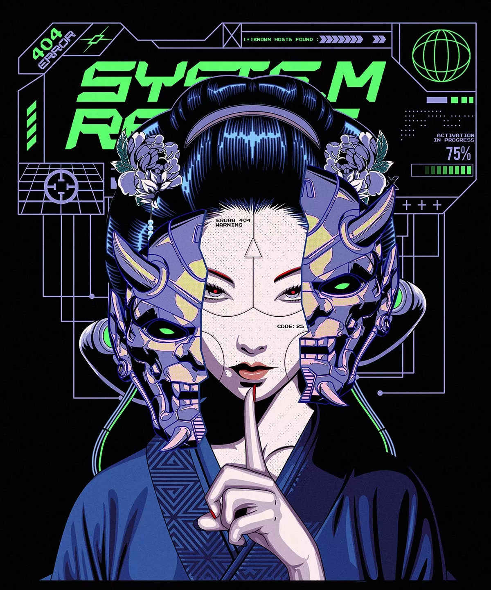

  

  

<h2 align="center">
  <b>#FullStackAIEngineer</b>
</h2>

  Helping people solve real problems with AI.

  
  

 

<!-- ===================================================== -->

<!-- SYSTEM STATUS -->

<!-- ===================================================== -->

<h2 align="center">▌ SYSTEM STATUS</h2>

<table align="center" width="600">

  <!-- BOOT -->
  <tr>
    <td colspan="3" align="left">
      
    </td>
  </tr>

  <!-- LOADING -->
  <tr>
    <td colspan="3" align="left">
      
    </td>
  </tr>

  <!-- STATUS -->
  <tr>
    <td align="right"><b>STATUS</b></td>
    <td>&nbsp;:&nbsp;</td>
    <td align="left">
      
    </td>
  </tr>

  <!-- ROLE -->
  <tr>
    <td align="right"><b>ROLE</b></td>
    <td>&nbsp;:&nbsp;</td>
    <td align="left">
      
    </td>
  </tr>

  <!-- SPECIALTY -->
  <tr>
    <td align="right"><b>SPECIALTY</b></td>
    <td>&nbsp;:&nbsp;</td>
    <td align="left">
      
    </td>
  </tr>

</table>

 

<!-- ===================================================== -->

<!-- PLAYER PROFILE -->

<!-- ===================================================== -->

<h2>▌ PLAYER PROFILE</h2>

<table align="center">
<tr>

<td align="left" width="55%">

  
    <b>開発</b>
  
  <code> / DEVELOPMENT</code>

  <b>FULL STACK × AI ENGINEER</b>

  I build software from idea to execution - 
  combining full - stack engineering, backend systems,  
  and AI to turn problems into useful products. 

 

  <b>創造</b>
  <code> / WHAT I BUILD</code>

  Full-stack applications 
  Backend & API systems 
  AI-powered products 
  Intelligent agents & automation 
  Developer tools & experiments

 

  <b>進化</b>
  <code> / ENGINEERING LOOP</code>

  <b>
    BUILD
    →
    SHIP
    →
    LEARN
    →
    REPEAT
  </b>

</td>

<!-- VISUAL -->
<td align="center" width="45%">

</td>

</tr>
</table>

 

<!-- ===================================================== -->

<!-- TECH STACK -->

<!-- ===================================================== -->

<h2 align="center">
  ▌ TECH ARSENAL
</h2>

<h3 align="center">《 LANGUAGES 》</h3>

<h3 align="center">《 FRONTEND 》</h3>

<h3 align="center">《 BACKEND 》</h3>

<h3 align="center">《 DATABASES 》</h3>

<h3 align="center">《 AI / DATA 》</h3>

<h3 align="center">《 DESKTOP / MOBILE / GRAPHICS 》</h3>

<h3 align="center">《 DEVOPS / CLOUD / TOOLING 》</h3>

 

<!-- ===================================================== -->

<!-- GITHUB STATS -->

<!-- ===================================================== -->

<h2 align="center">
  ▌ GITHUB STATS
</h2>

	

  

  

**🪭 NEURAL PATHWAY VISUALIZATION**

[//]: # (
)

[//]: # ()
[//]: # (**🪭 NEURAL PATHWAY VISUALIZATION**)

[//]: # ()
[//]: # ()

[//]: # ()
[//]: # (
)

 

<!-- ===================================================== -->

<!-- CONNECT -->

<!-- ===================================================== -->

<h2 align="center">
  ▌ CONNECT
</h2>

 

<h2 align="center">
  ▌ Buy me a coffee
</h2>

 

<!-- ===================================================== -->

<!-- FOOTER -->

<!-- ===================================================== -->

<h3 align="center">
  「 GIVE ME THE CODE, I CAN FIX THAT 」
</h3>

[//]: # ()

[//]: # (創造 &#40;Sōzō&#41; → Creation / Creating)

[//]: # (コード &#40;Kōdo&#41; → Code)

[//]: # (未来 &#40;Mirai&#41; → Future)
